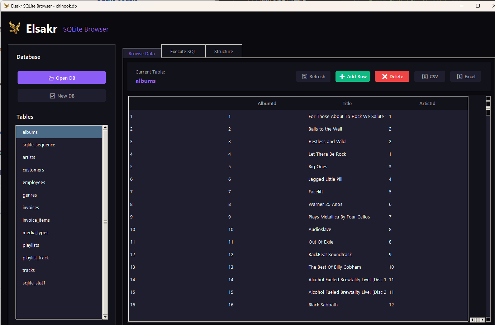

# 🦅 Elsakr SQLite Browser

[](https://elsakr.company)
[](https://elsakr.company)
[](LICENSE)


## Overview
Part of the **Elsakr Open Source Tools Ecosystem** — global proactive solutions for developers, designers, and marketers.
> **[View All Tools](https://elsakr.company/tools)**

**Browse. Query. Export. Your data, your control.**
A lightweight yet powerful SQLite database manager with a **Premium Dark UI**. Explore tables, execute SQL queries, and export data — all without leaving your desktop.

## 🚀 Features
- 🔹 **Premium Dark Theme**: Sleek, modern interface optimized for long sessions.
- 🔹 **Data Browser**: View tables with automatic pagination (1000 rows limit).
- 🔹 **CRUD Operations**: Add and delete rows safely using unique IDs.
- 🔹 **SQL Executor**: Run custom queries and view results instantly.
- 🔹 **Structure Viewer**: Inspect schemas, columns, and CREATE statements.
- 🔹 **Export**: One-click export to CSV and Excel formats.

## 📸 Screenshots / Demo


## 📦 Getting Started

### 💻 Installation
Download the latest release or clone the repo:
```bash
git clone https://github.com/khalidsakrjoker/Elsakr-SQLite-Browser.git
cd Elsakr-SQLite-Browser
```

### ▶️ Usage
1. **Open/Create DB**: Use the sidebar to open an existing `.db` file or create new.
2. **Browse Data**: Select a table to view its contents.
3. **Execute SQL**: Switch to the SQL tab and run custom queries.
4. **Export**: Click CSV or Excel buttons to export current table.

### 🛠️ Run from Source
```bash
python -m venv venv
.\venv\Scripts\activate
pip install -r requirements.txt
python main.py
```

## 🤝 Contributing
Improvements and bug fixes are welcome and appreciated.

## 📝 License
This project is licensed under the MIT License.

## ⭐ Signature
**Elsakr** — *Open Source Tools with a Falcon's Vision.*  
[elsakr.company](https://elsakr.company)

---

# 🇪🇬 النسخة العربية (Arabic Version)

## 🦅 متصفح SQLite (SQLite Browser)
أداة خفيفة وقوية لإدارة قواعد بيانات SQLite. استعرض الجداول، نفذ استعلامات SQL، وصدّر البيانات لـ CSV و Excel — كل ده بواجهة داكنة احترافية.
